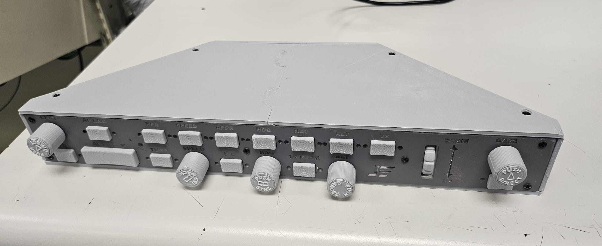
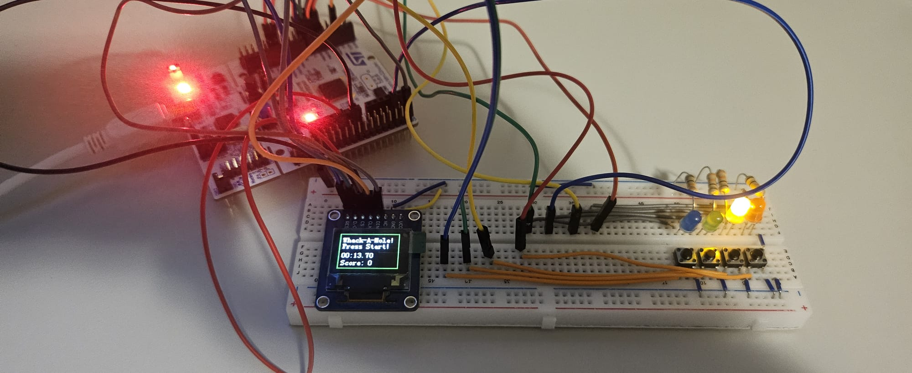
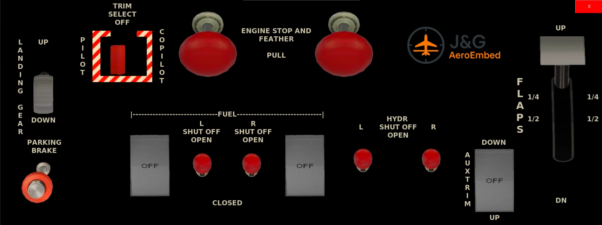
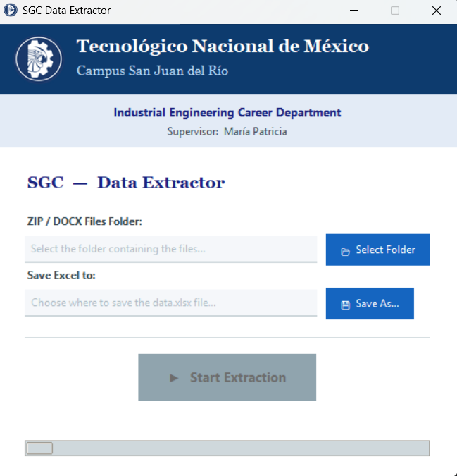

# Personal Projects Portfolio

Welcome to my Personal Projects repository, a hub showcasing the embedded systems, firmware, and software projects I’ve built.  
Each project links to its own repository with **source code**, **documentation**, and in some cases **demo videos**.

# Featured Projects

## 🔧 Embedded Systems / C Project

### **1. CRJ‑200 Autopilot Panel – STM32 Firmware**
**C | STM32F4 | Interrupts | UART | Encoders | LEDs | Data Packing**

  

  

  

  

An automation tool designed to extract and consolidate academic metrics from institutional SGI documents into professional Excel reports.

Highlights:
- **Multithreaded Architecture**: Background processing ensures a responsive UI during heavy I/O operations.
- **Automated Document Conversion**: Interfaces with Microsoft Word COM API to convert legacy `.doc` files to `.docx` automatically.
- **Advanced Regex Parsing**: Robust extraction of teacher data, subjects, and tracking tables, even across complex paragraph splits.
- **Recursive Processing**: Scans entire directories and deep-reads inside `.zip` archives to locate relevant documentation.
- **Formatted Data Export**: Generates styled Excel workbooks with frozen panes, alternating row colors, and auto-adjusted layouts.

🔗 **Repository:** [Link to Repository](https://github.com/GuillermoBaUr/data-extraction-project)

--- 

 👤 About Me

I’m a Mechatronics Engineer with experience across electronics, control systems, robotics, and embedded programming :

- STM32 firmware (C/C++)  
- FreeRTOS and real‑time design  
- Python simulation frameworks  
- Hardware‑software integration  
- Communication protocols (UART, SPI, I2C, UDP)

I focus on building systems that combine **clear architecture**, **robust communication**, and **deterministic real‑time behavior**, from both my **Mechatronics Engineering foundation** and my experience in **software development, testing, and embedded systems**.

---

# 📬 Contact

If you'd like to collaborate or have any questions:

📧 **Email:** [badillouribeguillermoca@gmail.com](mailto:badillouribeguillermoca@gmail.com)  
🔗 **LinkedIn:** https://www.linkedin.com/in/guillermo-badillo-uribe-382301228/

---

# 📝 License

This repository is licensed under the MIT License.  
See the `LICENSE` file for more details.
